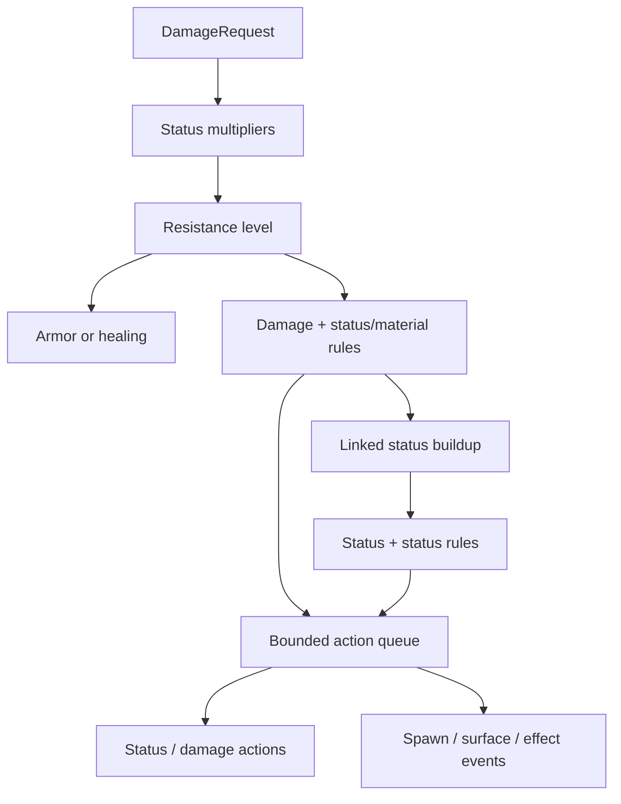

# Data-driven damage, statuses and elemental reactions

## Ключевая модель

Система использует открытые `StringName` ID (`fire`, `burning`, `water`), а не закрытые enum типов. Новый тип урона, статус, материал, множитель или правило реакции добавляется строкой данных. Код меняется только при появлении принципиально нового **вида действия**, которое runtime ещё не умеет исполнять.

`NONE` не хранится как отдельный статус: это отсутствие активных статусов и buildup. Такой вариант не создаёт конфликтующий runtime marker.



## Основные классы

| Класс | Ответственность |
| --- | --- |
| `ElementalCatalog` | Единственный API чтения raw prototype/будущих CSV-таблиц; возвращает typed definitions. |
| `ElementalDamageDefinition` | Связь damage type с накапливаемым status и коэффициентом buildup. |
| `ElementalStatusDefinition` | Порог активации/деактивации, максимум, duration, decay, resistance modifiers. |
| `ElementalReactionDefinition` | Триггер, приоритет и упорядоченные actions одной реакции. |
| `C_ElementalState` | Runtime authority buildup/activity/duration на actor, клетке, зоне, облаке, поверхности или projectile. |
| `C_DamageResistances` | Target type, индивидуальные base overrides и внешние modifiers. |
| `C_StatusImmunities` | Отдельные immunity IDs; не смешиваются с damage resistance. |
| `C_ReactiveMaterials` | Material/surface tags (`water`, `earth`, `poison_material`). |
| `ElementalResolver` | Порядок вычислений, запуск damage/status/material reactions. |
| `ElementalResolutionContext` | Общие depth/action limits, FIFO queue и reaction fingerprint guard. |
| `ElementalActionExecutor` | Core actions; semantic world actions передаёт через typed event. |
| `O_Damage` | Существующая точка изменения Health: resolver → Armor или HealService → events/death. |
| `O_ElementalStatus` / `S_ElementalStatus` | Direct status requests и duration/decay без component churn. |
| `O_ElementalWorldAction` | Опциональное world-owned сопоставление semantic IDs с PackedScene/EffectDefinition. |

## Накопление и длительность

Каждый `ElementalStatusState` хранит четыре независимые части состояния:

- `buildup` в диапазоне `0...max_buildup`;
- `active`, включаемый при `activation_threshold`;
- `remaining_duration`, обновляемый положительным воздействием на активный статус;
- provenance `source/ability` последнего положительного воздействия.

Используется hysteresis: активация происходит на верхнем пороге, деактивация — на меньшем `deactivation_threshold`. Неактивный buildup также постепенно убывает. При окончании duration buildup очищается, чтобы истёкший статус не включился снова без нового воздействия.

Противоположные статусы взаимодействуют величиной `reaction_power = min(left.buildup, right.buildup)`. Поэтому накопленные `100 BURNING` и новое воздействие, создавшее только `1 COLD`, не превращаются мгновенно в `WET`. Пока `COLD` не достиг порога, реакции вообще нет; после активации расходуется только реально накопленная встречная сила.

Prototype thresholds находятся в `content/elemental/prototype_elemental_catalog.gd` и являются балансными данными, а не логикой resolver.

## Порядок одного DamageRequest

1. Resolver делает snapshot активных статусов.
2. Все заданные damage/status multipliers перемножаются. Неуказанная пара даёт `1.0`.
3. Вычисляется итоговый resistance level.
4. `raw_damage * status_multiplier * resistance_multiplier` даёт signed health amount.
5. Положительный amount проходит Armor в `O_Damage`; отрицательный отправляется в `HealService`.
6. По существовавшим до удара активным статусам запускаются `damage_status` reactions.
7. По material tags запускаются `damage_material` reactions.
8. Выполняются actions этих реакций.
9. Из **raw damage** независимо от resistance/Armor накапливается связанный статус.
10. После достижения порога выполняются `status_status` reactions и их actions.

Шаг 9 намеренно использует raw impact power: damage immunity не должна автоматически давать status immunity. Для полного иммунитета цель получает отдельный ID в `C_StatusImmunities`.

### Полный пример: 50 FIRE по WET цели

Допущения: living target, `WET buildup = 40`, Armor `20`, FIRE resistance `0`.

1. FIRE+WET multiplier: `0.8`; `50 * 0.8 = 40`.
2. Resistance `0` даёт `1.0`; signed pre-armor damage остаётся `40`.
3. Armor formula даёт `40 * 100 / 120 = 33.33` снятого Health.
4. `fire_quenches_wet` получает power `min(50, 40) = 40`.
5. Action уменьшает WET на `40`; status деактивируется.
6. `SpawnEntity(wet_mist_zone)` публикует typed world action; настроенный adapter создаёт сцену тумана в hit position.
7. FIRE накапливает `50 BURNING`; порог `30` пройден, BURNING активируется.

Итог: `-33.33 HP`, WET снят, BURNING `50`, запрошено создание влажного тумана.

## Резисты

Для одного damage type берутся:

```text
final = clamp(base + strongest_negative + strongest_positive, -1, 4)
```

Модификаторы одинакового знака не суммируются независимо от количества предметов, статусов или эффектов. Stable `source_id` не позволяет одному источнику случайно продублировать modifier.

| Level | Семантика | Damage multiplier |
| ---: | --- | ---: |
| -1 | Уязвимость | 2.0 |
| 0 | Нет | 1.0 |
| +1 | Сопротивление | 0.5 |
| +2 | Иммунитет к damage | 0.0 |
| +3 | Синергия | -0.5 |
| +4 | Родство | -1.0 |

Пример: living имеет base `NEGATIVE = -1`; modifiers `+1`, `+2`, `-3`, `-1` дают `-1 + 2 - 3 = -2`, затем clamp до `-1`. Без отрицательных modifiers base `-1 + strongest(+1,+2) = +1`.

## Формат данных и API

Prototype хранит нормализованные массивы строк внутри одного Dictionary:

```gdscript
{
    "damage_types": [
        {"id": "fire", "buildup_status": "burning", "buildup_per_damage": 1.0},
    ],
    "damage_multipliers": [
        {"damage_type": "fire", "status": "wet", "multiplier": 0.8},
    ],
    "reactions": [
        {
            "id": "fire_quenches_wet",
            "trigger": "damage_status",
            "first": "fire",
            "second": "wet",
            "priority": 100,
            "actions": [
                {"kind": "modify_status", "status": "wet", "amount": -1.0, "scale_with_power": true},
                {"kind": "spawn_entity", "semantic_id": "wet_mist_zone"},
            ],
        },
    ],
}
```

Gameplay не вызывает `.get()` на этих таблицах:

```gdscript
var catalog: ElementalCatalog = PrototypeElementalCatalog.create()
var wet: ElementalStatusDefinition = catalog.get_status(ElementalIds.STATUS_WET)
var multiplier: float = catalog.get_damage_multiplier(ElementalIds.DAMAGE_FIRE, wet.id)
```

Typed public requests:

```gdscript
DamageService.request(target, DamageRequest.new(
    caster, ability, 50.0, hit_position, direction,
    DamageRequest.Kind.DIRECT, ElementalIds.DAMAGE_FIRE,
))

ElementalService.request_status(target, ElementalStatusRequest.new(
    caster, ability, ElementalIds.STATUS_WET, 40.0,
))
```

Ability может иметь `elemental_statuses: Array[ElementalStatusApplicationDefinition]`, поэтому status delivery не требует ненулевого damage.

## Actions и защита цепочек

Поддержаны actions:

- `ModifyStatus`, `ApplyStatus`, `RemoveStatus`;
- `DealDamage` через тот же `DamageService`;
- `SpawnEntity`;
- `TransformSurface`, `AddMaterial`, `RemoveMaterial`;
- `EmitEffect`.

Каждая root-операция имеет FIFO queue (по умолчанию до 64 actions), максимальную вложенность 8 и fingerprint `(target instance, reaction id)`. Приоритет сортирует matching rules, ID обеспечивает стабильный порядок при равном приоритете. Nested damage наследует тот же context; автоматический status buildup для reaction damage выключен, пока data явно не создадут отдельный ApplyStatus action.

## Окружение

Материалы — теги, а не «мгновенные статусы»:

- `ELECTRIC + water` заменяет material state на `electrified_water` и публикует `water_chain_electricity` effect action;
- `ELECTRIC + electrified` запускает `electric_overload`: дополнительный electric damage и semantic effect; shared context не позволяет реакции вызвать саму себя бесконечно;
- `FIRE + wet` расходует WET buildup и публикует spawn `wet_mist_zone`;
- `POISON + poison_material` публикует spawn `poison_cloud`;
- `FIRE + earth` меняет surface state на `lava`.

Клетка grid, Area3D-зона, облако, поверхность и projectile становятся участниками одинаково: им добавляются `C_ElementalState`, `C_DamageResistances`, `C_StatusImmunities`, `C_ReactiveMaterials` по необходимости. `C_Health` для environment subject необязателен: `O_Damage` всё равно разрешит material/status reactions, но не станет менять HP. Transform/position остаются authority Godot Node.

`TransformSurface` немедленно меняет gameplay material tag. Scene mesh, particles и audio меняются adapter-ом по `ElementalWorldActionEvent`. `SpawnEntity` создаёт настроенный PackedScene через `O_ElementalWorldAction`; если spawned object должен стать GECS Entity, конкретный world adapter обязан зарегистрировать его согласно lifecycle этого мира.

## Тестовые сценарии

`ElementalReactionScenarios.run_all()` возвращает пустой `Array[String]` при успехе и список ошибок при провале.

| Сценарий | Проверка |
| --- | --- |
| Catalog | Все ссылки валидны; sparse default = 1.0. |
| Threshold | `1 COLD` не активируется и не снимает `100 BURNING`. |
| Opposed buildup | После достижения COLD threshold расходуется только равная сила, создаётся WET. |
| Multipliers | `10 PHYSICAL` по FROZEN → `25` до Armor. |
| Resistance stacking | Выбирается один strongest modifier каждого знака, затем clamp. |
| Damage immunity | FIRE level `+2` блокирует HP damage, но не BURNING buildup. |
| Status immunity | BURNING immunity блокирует buildup, но не FIRE damage. |
| Affinity | Living POSITIVE `+4` превращает 10 damage в 10 healing. |
| Environment | ELECTRIC+WATER → electrified water; FIRE+EARTH → lava. |
| Queue guard | Лимит в один action останавливает multi-action chain. |
| Duration/decay | Decay уменьшает buildup; expiry очищает status state. |

Godot в этой ветке намеренно не запускался. Runtime smoke-проверка выполняется владельцем проекта по `docs/TESTING.md`.

## Переход на CSV

Рекомендуемый формат — отдельные таблицы `damage_types.csv`, `statuses.csv`, `damage_multipliers.csv`, `resistance_levels.csv`, `target_resistances.csv`, `reactions.csv`, `reaction_actions.csv`. Импортёр должен:

1. прочитать CSV на infrastructure boundary;
2. нормализовать строки к текущему document shape;
3. вызвать `ElementalCatalog.from_dictionary()`;
4. отклонить reload при непустом `get_validation_errors()`;
5. атомарно заменить catalog для **новых** impacts, сохранив definition snapshots уже активных статусов до их завершения.

Для production стоит добавить schema version, source row/column в validation errors, uniqueness constraints для ID и checksum конфигурации для network/replay determinism.

## Явные допущения

- Несколько одновременно активных status multipliers перемножаются; конфликтующие статусы обычно схлопываются реакциями.
- Status buildup берётся из raw damage до resistance и Armor, потому что status immunity является отдельной механикой.
- Armor применяется после elemental multipliers/resistance и только к положительному damage; healing Armor не уменьшает.
- Positive input обновляет duration активного статуса; expiry полностью очищает buildup.
- Status+status reaction запускается, когда новый/усиленный статус активен; latent buildup ниже порога не реагирует.
- `EARTH` и `WATER` — material IDs, а не damage types. Если позже появится earth damage, его можно добавить отдельной строкой без изменения resolver.
- Prototype `Burning` Effect (DoT) и elemental `BURNING` state пока независимы. Их можно связать data action `EmitEffect` через world binding, не смешивая duration Effect Entity с buildup component.
